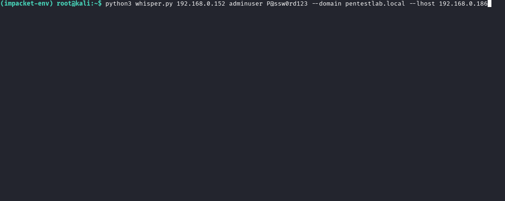

# WMI-Whisper: Lightweight Post-Exploitation Framework (WMI + PowerShell + SMB)

A clean, minimal remote access toolkit leveraging native Windows features — WMI for code execution and authenticated SMB for output retrieval. Built for red teamers, researchers, and students.

> 🛡️ No dropped binaries, no `cmd.exe`, no noisy services — just pure tradecraft.

---

## ✨ Features
- ✔️ Executes commands remotely via `Win32_Process.Create`
- ✔️ Uses `powershell.exe -WindowStyle Hidden` 
- ✔️ Captures output via authenticated SMB share
- ✔️ Launches its own internal SMB server
- ✔️ No third-party payloads or shellcode
- ✔️ Compatible with modern Windows (10/11)

---

## 🧰 Requirements

- Python 3.8+
- Impacket (install from source or `pip`)
- Outbound SMB access (port 445) to your C2 box
- Valid credentials on the target system

---

## ⚙️ Setup

```bash
# Install system deps
sudo apt install python3 python3-pip -y

# Clone & install impacket
git clone https://github.com/fortra/impacket
cd impacket
pip install .
```

---

## 🚀 Usage

This section walks you through setting up the environment, installing dependencies, and running **WMIWhisper**.

---
### 🧱 Requirements 

Before running the tool, make sure the following are in place:

- 🐧 **Linux system** (tested on Kali Linux)
- 🐍 **Python 3.8+**
- 📡 Target Windows machine must:
  - Be accessible over the network
  - Allow WMI/DCOM traffic (port 135 + dynamic RPC)
  - Allow outbound SMB (port 445) to your attacker machine
  - Use credentials with **admin or WMI privileges**

---

### ⚙️ Environment Setup (First Time Only)

I highly recommend using a **Python virtual environment** to keep your system clean:

```bash
# 1. Update your system
sudo apt update

# 2. Install Python, pip, and venv
sudo apt install python3 python3-pip python3-venv -y

# 3. Create and activate a virtual environment
python3 -m venv ~/wmienv
source ~/wmienv/bin/activate

```

### 📦 Install Dependencies (Impacket)

```bash
# 4. Clone the Impacket repository
git clone https://github.com/fortra/impacket.git

# 5. Navigate into the Impacket directory
cd impacket

# 6. Install Impacket and all required packages
pip install .
```

### 📂 Confirm impacket-smbserver is Available
Check that the impacket-smbserver script was installed correctly:
```bash 
which impacket-smbserver
```
You should see a valid path (like `/usr/local/bin/impacket-smbserver`). If not, ensure you're inside the virtual environment and that installation completed successfully.


| Arg      | Description                         |
| -------- | ----------------------------------- |
| TARGET   | Remote Windows IP                   |
| USERNAME | Admin or WMI-capable user           |
| PASSWORD | Account password                    |
| --domain | Domain (leave blank for local user) |
| --lhost  | Your IP for receiving output (SMB)  |

## 📂Output

- Logs are saved in: `/tmp/dropzone/`
- Each command generates: `result_<timestamp>.log`
- Output is pulled directly via SMB

## 🛡️OPSEC Notes

- No `cmd.exe /c` — common alert signature
- `powershell.exe -WindowStyle Hidden` used for execution
- SMB authentication avoids Windows 10/11 guest access blocks
- No on-disk payloads or artifacts

## 📸 DEMO


## ✅ Legal & Ethics
This project is intended strictly for educational and authorized testing purposes.
Do not use it against systems you do not own or have explicit permission to test.


- Based on [Impacket](https://github.com/fortra/impacket)

- Built by a cybersecurity researcher and student


